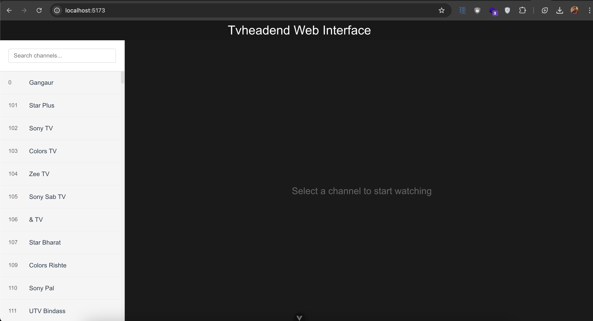
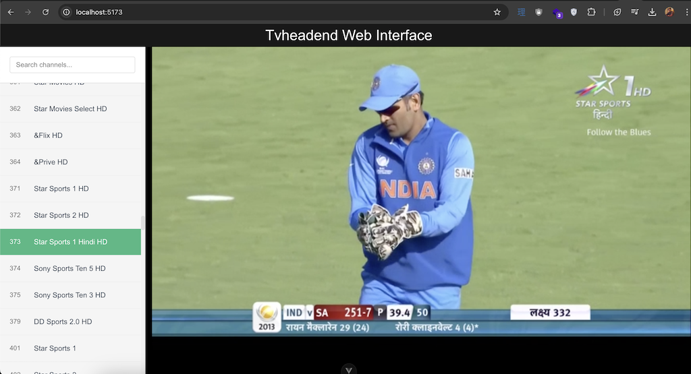
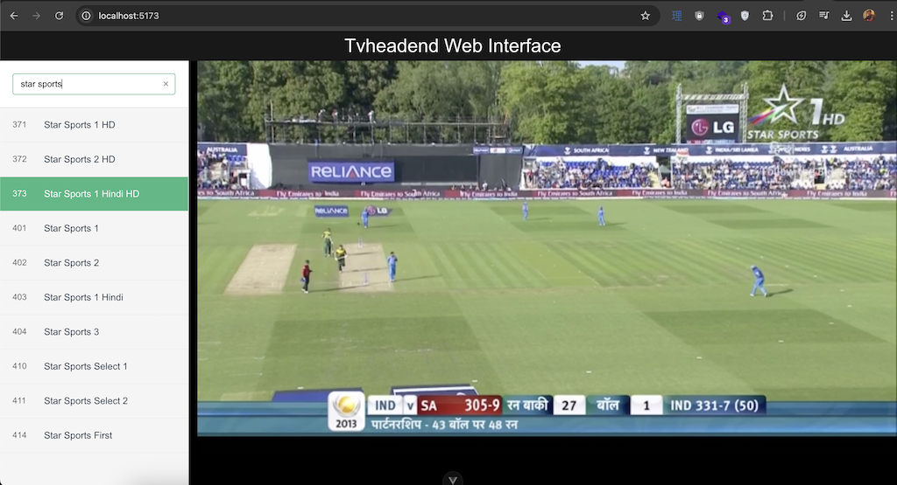

# tvheadend-client

Tvheadend Web Interface Client for watching channels

## Project Setup

```sh
npm install
```

### Create .env file and set TVHEADEND_USERNAME, TVHEADEND_PASSWORD and TVHEADEND_URL

```sh
cp .env.sample .env
```

### Compile and Hot-Reload for Development

```sh
npm run dev
```

### Type-Check, Compile and Minify for Production

```sh
npm run build
```

## Screenshots






